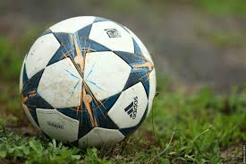

[← Volver al inicio](README.md)
# Temas del curso

```
### 18/09/2026 - Mis aficiones

En mi tiempo libre me gusta pasar tiempo con mi familia y amigos,
también me gusta jugar a la play o ver series. 
Me gusta el fútbol, aunque tuve que dejarlo porque tuve 2
operaciones de rodilla y cada vez que juego me vuelve a doler.
También me gustan los coches aunque últimamente no le doy mucha importancia.
```

.

[He estado investigando en internet y he encontrado una web de fútbol](https://eddwebster.com/)


```
### 29/09/2026 - Premios Princesa de Asturias

La Bóveda Global de Semillas de Svalbard ha sido galardonada al premio princesa de Asturias al premio de cooperación internacional
por ser un pilar para la ciencia y la alimentación, buscando asegurar alimentos para un futuro después de un desastre natural.
Lo he elegido porque me parece muy importante y una gran aportación al futuro de la humanidad.
```

.

Imagen: Getty Images, [Traveler.es](https://www.traveler.es/experiencias/articulos/banco-mundial-de-semillas-de-svalbard-error-llamarlo-boveda-fin-del-mundo/17662)

